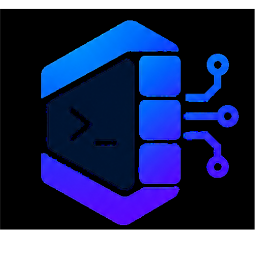
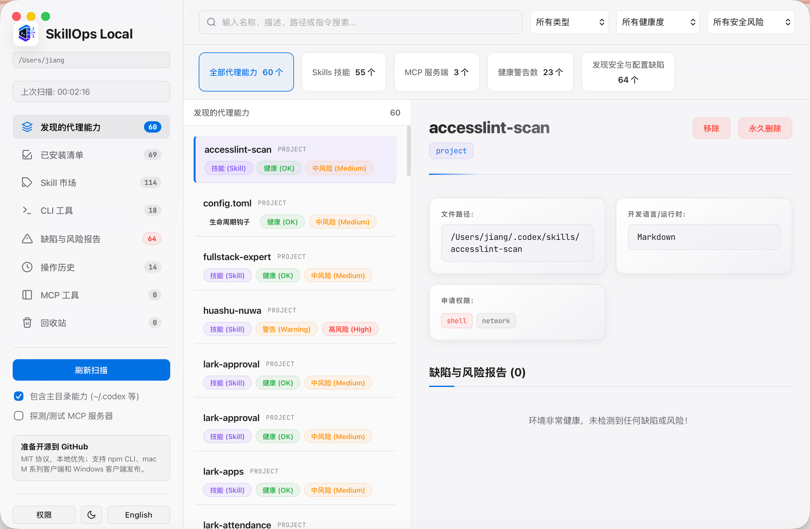
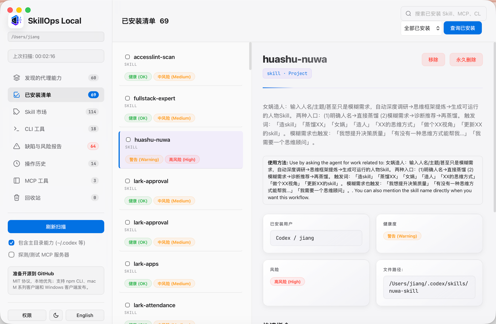
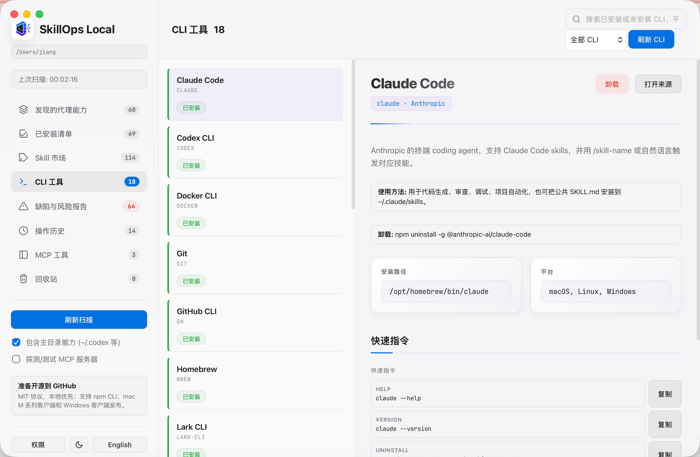

# SkillOps Local

**Language / 语言:** [简体中文](./README.md) | English



[](https://github.com/IYUNCI/skillops-local/releases)
[](./LICENSE)

SkillOps Local is a local-first workbench for AI agent capabilities. It brings local Skills, MCP servers, and CLI tools into one desktop and CLI experience, so developers can scan capability sources, review health and risk signals, manage installed skills, and run agent workflows with clearer local control.

## Screenshots







## Core Features

- Scan local and project-level Skills, MCP servers, and CLI tools into one capability inventory.
- Review `SKILL.md` metadata, runtime requirements, permissions, and common risk patterns.
- Manage installed Skills with local remove, trash recovery, and permanent delete flows.
- Install Skills from the bundled market or GitHub sources.
- Open a local Web UI for inventory, risk review, MCP inspection, CLI tool management, history, and recycle bin workflows.
- Keep data local by default; the CLI and desktop client work against local files and local configuration.

## Release Channels

- `npm` CLI package for terminal-first developer workflows.
- macOS M-series desktop client built with Wails and Go.
- Windows desktop client built with Wails and Go.
- GitHub Releases provide versioned desktop packages and checksum-friendly artifacts.

## Quick Start

Run the local UI with npm:

```bash
npx skillops-local ui --open
```

If installed globally:

```bash
skillops ui --open
```

Default local address:

```text
http://localhost:18765/
```

## Desktop Client

Start the desktop app in development mode:

```bash
npm run desktop
```

Build macOS M-series and Windows clients:

```bash
npm run desktop:pack:all
```

Build one platform at a time:

```bash
npm run desktop:pack:mac-m4
npm run desktop:pack:win
```

Open the local macOS build:

```bash
open "$HOME/.skillops/builds/wails/mac-arm64/SkillOps Local.app"
```

## Development

Install dependencies and build the CLI:

```bash
npm install
npm run build
node dist/cli.js scan
```

Common development commands:

```bash
npm run dev -- scan
npm run dev -- lint ~/.codex/skills/some-skill
npm run dev -- doctor mcp github
npm run dev -- share ~/.codex/skills/some-skill --include-source
npm run dev -- ui --open
```

## CLI Commands

```bash
skillops scan [--json] [--root <path>]
skillops lint <skill-dir> [--json]
skillops doctor mcp <name-or-config-path> [--json]
skillops share <skill-dir> [--out <path>] [--include-source] [--json]
skillops updates check [--json]
skillops updates upgrade <skill-dir> --yes
skillops preview skill <local-or-github-source> [--json]
skillops mcp tools [name-or-config-path] [--json]
skillops mcp install <name> --command <cmd> [--arg <arg>] --yes
skillops risk audit <skill-dir> [--json]
skillops profile export [--out <path>] [--json]
skillops profile import <profile-path> [--json]
skillops history list [--json]
skillops db snapshot [--json]
skillops feedback add <target-id> --rating <1-5> [--comment <text>]
skillops compat matrix [--json]
skillops create skill <name> [--root <skills-root>]
skillops eval skill <skill-dir> [--json]
skillops review skill <skill-dir> [--json]
skillops graph dependencies [--json]
skillops watch
skillops ui [--port <port>] [--host <host>] [--root <path>] [--open]
```

## Open Source

SkillOps Local is released under the MIT License. See [LICENSE](./LICENSE).

Contributions are welcome through issues and pull requests. See [CONTRIBUTING.md](./CONTRIBUTING.md) for the contributor guide.

## Version

- Version: `0.1.6`
- Author: `yunpai`
- Copyright: `Copyright © 2026 yunpai / 云磁数字`
